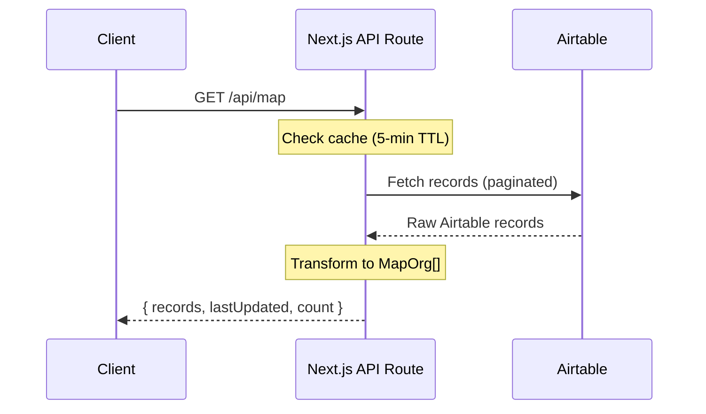

# AISafety.com - API Contracts

## Overview

The application uses Next.js API Routes to proxy requests to Airtable, providing a layer of abstraction and server-side credential management.



## Authentication

All API routes authenticate with Airtable using environment variables:

| Variable           | Description                    | Required |
| ------------------ | ------------------------------ | -------- |
| `AIRTABLE_TOKEN`   | Airtable Personal Access Token | Yes      |
| `AIRTABLE_BASE_ID` | Airtable Base identifier       | Yes      |

**Note:** These are server-side only and never exposed to the client.

---

## Endpoints

### GET `/api/map`

Fetches all organization data for the interactive map and card listings.

#### Request

```http
GET /api/map HTTP/1.1
Host: aisafety.com
```

No parameters required.

#### Response

**Success (200 OK)**

```json
{
  "records": [
    {
      "id": "rec123abc",
      "title": "MIRI",
      "shortName": "MIRI",
      "description": "Machine Intelligence Research Institute conducts research...",
      "category": "Conceptual research, Strategy",
      "status": "Active",
      "logo": "https://dl.airtable.com/.attachments/...",
      "mapLogo": "https://dl.airtable.com/.attachments/...",
      "link": "https://intelligence.org/",
      "lastModified": "2025-12-15",
      "x": 46.5,
      "y": 12.3,
      "scale": "Large",
      "isMagic": false
    }
  ],
  "lastUpdated": "January 8, 2026",
  "count": 323
}
```

**Error (500 Internal Server Error)**

```json
{
  "error": "Airtable credentials not configured"
}
```

```json
{
  "error": "Airtable API error: 401"
}
```

```json
{
  "error": "Failed to fetch map data"
}
```

#### Response Schema

| Field         | Type             | Description                      |
| ------------- | ---------------- | -------------------------------- |
| `records`     | `MapOrg[]`       | Array of organization objects    |
| `lastUpdated` | `string \| null` | Human-readable last updated date |
| `count`       | `number`         | Total number of records          |

**MapOrg Object:**

| Field          | Type             | Description                                       |
| -------------- | ---------------- | ------------------------------------------------- |
| `id`           | `string`         | Airtable record ID                                |
| `title`        | `string`         | Organization name                                 |
| `shortName`    | `string \| null` | Abbreviated name for map labels                   |
| `description`  | `string`         | Organization description                          |
| `category`     | `string`         | Comma-separated categories                        |
| `status`       | `string`         | "Active" or other status                          |
| `logo`         | `string \| null` | Logo URL for cards                                |
| `mapLogo`      | `string \| null` | Logo URL for map                                  |
| `link`         | `string`         | Organization website                              |
| `lastModified` | `string \| null` | Date added to database                            |
| `x`            | `number \| null` | Map X coordinate (grid units)                     |
| `y`            | `number \| null` | Map Y coordinate (grid units)                     |
| `scale`        | `string \| null` | Logo size: "Small", "Medium", "Large"             |
| `isMagic`      | `boolean`        | True for special rows (Merch, Last updated, etc.) |

#### Caching

- Response cached for 5 minutes via `next: { revalidate: 300 }`

#### Airtable Configuration

| Setting    | Value                            |
| ---------- | -------------------------------- |
| Table ID   | `tblvzbGL9q9dOO9Nc`              |
| View ID    | `viwJgtDFDmaP8PyoI`              |
| Pagination | Automatic (100 records per page) |

---

### GET `/api/last-updated/events`

Fetches the last updated date for the Events & Training section.

#### Request

```http
GET /api/last-updated/events HTTP/1.1
Host: aisafety.com
```

#### Response

**Success (200 OK)**

```json
{
  "lastUpdated": "2026-01-08T00:00:00.000Z",
  "formattedDate": "8 January 2026"
}
```

**Error (500 Internal Server Error)**

```json
{
  "error": "Airtable credentials not configured"
}
```

```json
{
  "error": "Failed to fetch last updated date"
}
```

#### Response Schema

| Field           | Type     | Description                        |
| --------------- | -------- | ---------------------------------- |
| `lastUpdated`   | `string` | ISO 8601 timestamp                 |
| `formattedDate` | `string` | Human-readable date (en-GB format) |

#### Airtable Configuration

| Setting   | Value                                |
| --------- | ------------------------------------ |
| Table ID  | `tblsglkum9Op43mvq` (Metadata table) |
| Record ID | `rec0oNUMVZuYVXU82`                  |

---

### GET `/api/last-updated/map`

Fetches the last updated date for the Map section.

#### Request

```http
GET /api/last-updated/map HTTP/1.1
Host: aisafety.com
```

#### Response

**Success (200 OK)**

```json
{
  "lastUpdated": "January 5, 2026"
}
```

**Error (500 Internal Server Error)**

```json
{
  "error": "Airtable credentials not configured"
}
```

```json
{
  "error": "Failed to fetch last updated date"
}
```

#### Response Schema

| Field         | Type             | Description                       |
| ------------- | ---------------- | --------------------------------- |
| `lastUpdated` | `string \| null` | Human-readable date from Airtable |

#### Airtable Configuration

| Setting   | Value                                          |
| --------- | ---------------------------------------------- |
| Table ID  | `tblvzbGL9q9dOO9Nc` (Same as map)              |
| Record ID | `recvDWyM9MW9q1GUj` ("Last updated" magic row) |

#### Caching

- Response cached for 5 minutes via `next: { revalidate: 300 }`

---

## TypeScript Interfaces

### AirtableRecord (Internal)

```typescript
interface AirtableRecord {
  id: string
  fields: {
    'Long name'?: string
    'Long name for cards'?: string
    'Short name'?: string
    Description?: string
    Category?: string[]
    'Category (text)'?: string
    Status?: string
    'Logo (for cards)'?: Array<{
      url: string
      thumbnails?: { large?: { url: string } }
    }>
    'Logo (for map)'?: Array<{
      url: string
      thumbnails?: { large?: { url: string } }
    }>
    Link?: string
    'Date added'?: string
    x?: number
    y?: number
    Scale?: string
  }
}
```

### MapOrg (Public API)

```typescript
interface MapOrg {
  id: string
  title: string
  shortName: string | null
  description: string
  category: string
  status: string
  logo: string | null
  mapLogo: string | null
  link: string
  lastModified: string | null
  x: number | null
  y: number | null
  scale: string | null
  isMagic: boolean
}
```

---

## Error Handling

All endpoints follow consistent error handling:

1. **Missing credentials** → 500 with `"Airtable credentials not configured"`
2. **Airtable API error** → Forward status code with `"Airtable API error: {status}"`
3. **Unexpected error** → 500 with generic message, error logged to console

---

## Usage Examples

### Fetching Map Data (Client-side)

```typescript
useEffect(() => {
  async function fetchData() {
    try {
      const res = await fetch('/api/map')
      if (!res.ok) throw new Error('Failed to fetch data')
      const data = await res.json()
      setOrgs(data.records)
      setLastUpdated(data.lastUpdated)
    } catch (err) {
      setError(err.message)
    } finally {
      setLoading(false)
    }
  }
  fetchData()
}, [])
```

### Fetching Last Updated (Client-side)

```typescript
const response = await fetch('/api/last-updated/events')
const data = await response.json()
// data.lastUpdated = "2026-01-08T00:00:00.000Z"
// data.formattedDate = "8 January 2026"
```
