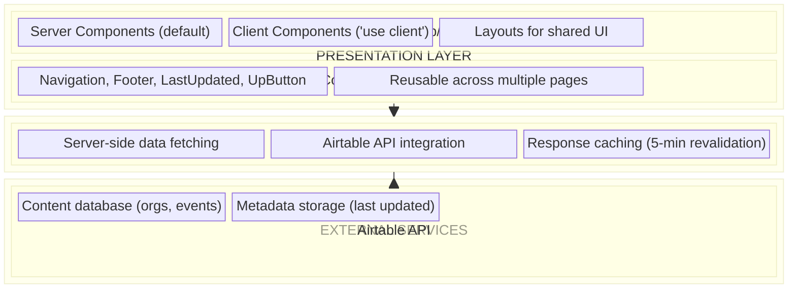
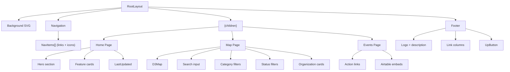
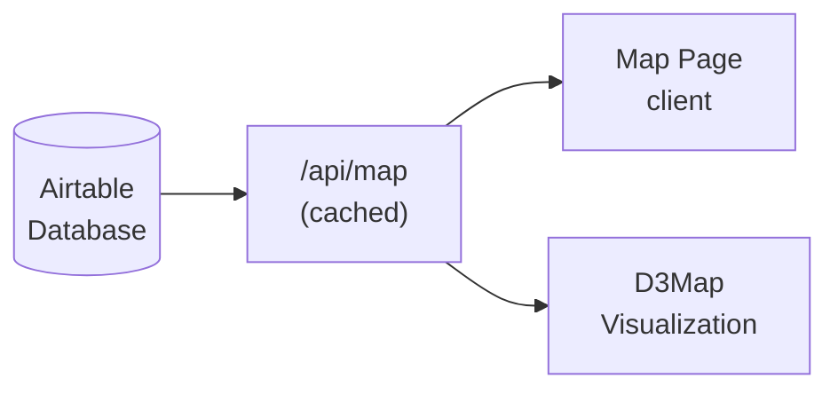

# AISafety.com - Architecture Documentation

## Overview

AISafety.com follows a **component-based architecture** using Next.js 16 App Router. The application is a server-rendered React application with client-side interactivity for the D3.js map visualization.

## Architecture Pattern

**Pattern:** Layered Component Architecture with App Router



## Directory Structure

```
src/
├── app/                          # Next.js App Router
│   ├── layout.tsx               # Root layout (Navigation + Footer)
│   ├── page.tsx                 # Home page
│   ├── globals.css              # Global styles (WebFlow + Tailwind)
│   ├── not-found.tsx            # 404 page
│   ├── api/                     # API routes
│   │   ├── map/route.ts         # Organization data endpoint
│   │   └── last-updated/        # Last updated endpoints
│   │       ├── events/route.ts
│   │       └── map/route.ts
│   ├── map/                     # Interactive map feature
│   │   ├── page.tsx             # Map page with filters
│   │   ├── D3Map.tsx            # D3.js visualization component
│   │   ├── layout.tsx           # Map-specific layout
│   │   └── page.module.css      # Map-specific styles
│   └── events-and-training/     # Events page
│       └── page.tsx
├── components/                   # Shared components
│   ├── Navigation.tsx           # Site header/nav
│   ├── Footer.tsx               # Site footer
│   ├── LastUpdated.tsx          # Dynamic timestamp display
│   └── UpButton.tsx             # Scroll-to-top button
```

## Component Architecture

### Server vs Client Components

| Component         | Type   | Reason                                |
| ----------------- | ------ | ------------------------------------- |
| `layout.tsx`      | Server | Static structure, no interactivity    |
| `page.tsx` (Home) | Server | Static content rendering              |
| `Navigation.tsx`  | Server | Static navigation links               |
| `Footer.tsx`      | Server | Static footer content                 |
| `map/page.tsx`    | Client | useState, useEffect for data fetching |
| `D3Map.tsx`       | Client | D3.js requires DOM access             |
| `LastUpdated.tsx` | Client | Dynamic data fetching                 |
| `UpButton.tsx`    | Client | onClick handler                       |

### Component Hierarchy



## Data Flow

### Organization Data Flow (Map Page)



### Data Transformation

1. **Airtable API** returns raw records with nested fields
2. **API Route** transforms to normalized `MapOrg` interface:
   ```typescript
   interface MapOrg {
     id: string
     title: string
     shortName: string | null
     description: string
     category: string
     status: string
     logo: string | null
     mapLogo: string | null
     link: string
     x: number | null // Map coordinates
     y: number | null
     scale: string | null
     isMagic: boolean // Special rows (Last updated, etc.)
   }
   ```
3. **Map Page** filters and displays data
4. **D3Map** renders organizations with coordinates on SVG canvas

## API Design

### Endpoints

| Endpoint                   | Method | Purpose                  | Caching |
| -------------------------- | ------ | ------------------------ | ------- |
| `/api/map`                 | GET    | Fetch all organizations  | 5 min   |
| `/api/last-updated/events` | GET    | Events last updated date | None    |
| `/api/last-updated/map`    | GET    | Map last updated date    | 5 min   |

### Authentication

All API routes use server-side environment variables for Airtable authentication:

- `AIRTABLE_TOKEN` - Personal Access Token
- `AIRTABLE_BASE_ID` - Database identifier

No client-side authentication is required.

## Styling Architecture

### Approach: Hybrid CSS

1. **Tailwind CSS v4** - Utility classes for layout and spacing
2. **Custom CSS (globals.css)** - WebFlow migration styles
3. **CSS Modules** - Component-specific styles (e.g., `page.module.css`)

### CSS Variable System

```css
:root {
  /* Color palette - Teal-based */
  --teal-100: #e3e5e6;
  --teal-300: #aab2b3;
  --teal-500: #717f80;
  --teal-700: #394c4e;
  --teal-900: #00191b; /* Primary background */

  /* Accent colors */
  --bright-teal-300: #a6dad9;
  --bright-teal-500: #6cbdbb;

  /* Typography */
  --font-inter: 'Inter', sans-serif;
}
```

### Responsive Design

- Mobile-first approach
- Breakpoints handled via Tailwind and custom media queries
- `.hide-mobile` class for desktop-only elements
- Map has mobile-optimized zoom levels (maxZoom: 25 on mobile vs 8 on desktop)

## State Management

### Local State Only

The application uses React's built-in state management:

| Component   | State                      | Purpose                        |
| ----------- | -------------------------- | ------------------------------ |
| Map Page    | `orgs`, `loading`, `error` | Data fetching state            |
| Map Page    | `searchQuery`              | Search filter                  |
| Map Page    | `selectedCategories`       | Category filter                |
| Map Page    | `showActive/Inactive`      | Status filter                  |
| D3Map       | `tooltip`                  | Hover tooltip position/content |
| LastUpdated | `lastUpdated`, `loading`   | Timestamp display              |

No global state management (Redux, Context) is used - each page manages its own state.

## Performance Considerations

### Optimizations Implemented

1. **Next.js Image Optimization** - Automatic image optimization via `next/image`
2. **Dynamic Imports** - D3Map loaded with `next/dynamic` to avoid SSR issues
3. **API Caching** - 5-minute revalidation on Airtable requests
4. **Lazy Loading** - Images use `loading="lazy"` attribute

### Bundle Considerations

- D3.js is a significant dependency (~250KB)
- Only loaded on `/map` page via dynamic import
- Tailwind CSS purges unused styles in production

## Security

### Environment Variables

- Airtable credentials stored in `.env.local` (gitignored)
- Server-side only - never exposed to client

### External Links

- All external links use `target="_blank"` with `rel="noopener noreferrer"`
- Prevents tab-nabbing attacks

### Content Security

- Airtable embeds use iframes (Events page)
- No user-generated content or form submissions to the server

## Deployment

### Platform: Vercel

- Automatic deployments from Git pushes
- Environment variables configured in Vercel dashboard
- Edge caching for API routes

### Build Process

```bash
npm run build  # Next.js production build
npm start      # Start production server
```

### Pre-deployment Checks

```bash
npm run lint        # ESLint
npm run type-check  # TypeScript
npm run format:check # Prettier
```
