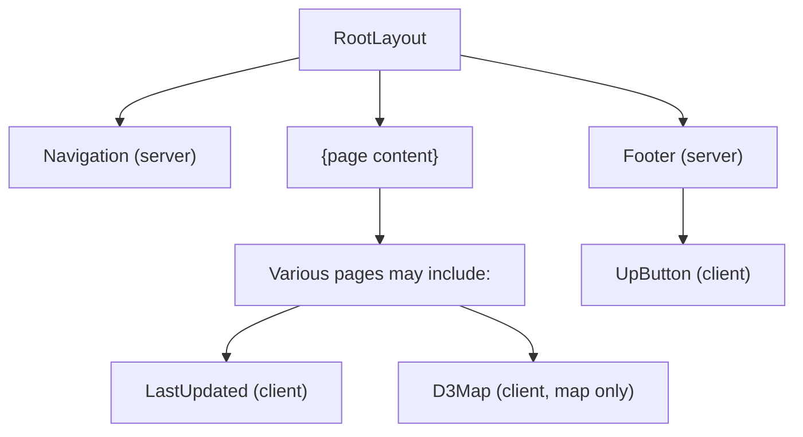

# AISafety.com - Component Inventory

## Overview

The application uses a minimal component architecture with 4 shared components and 1 feature-specific component (D3Map). All components are located in `src/components/` except for D3Map which lives with the map feature.

## Shared Components

### Navigation

**File:** `src/components/Navigation.tsx`
**Type:** Server Component
**Lines:** 60

#### Purpose

Site-wide header with logo and navigation links.

#### Props

None - uses static data.

#### Internal Data

```typescript
const navItems = [
  {
    href: '/events-and-training',
    label: 'Events & training',
    icon: 'calendar.svg',
    count: 48,
  },
  { href: '/map', label: 'Field map', icon: 'map.svg', count: 323 },
  { href: '/communities', label: 'Communities', icon: 'globe.svg', count: 196 },
  { href: '/self-study', label: 'Self-study', icon: 'book.svg', count: 25 },
  { href: '/jobs', label: 'Jobs', icon: 'briefcase.svg', count: 327 },
  { href: '/funding', label: 'Funding', icon: 'coins.svg', count: 49 },
]
```

#### Usage

```tsx
// In src/app/layout.tsx
<Navigation />
```

#### Features

- Logo links to home (`/`)
- 6 navigation items with icons and counts
- "+4" indicator for additional sections

---

### Footer

**File:** `src/components/Footer.tsx`
**Type:** Server Component
**Lines:** 104

#### Purpose

Site-wide footer with links, newsletter subscriptions, and attribution.

#### Props

None - uses static data.

#### Sections

1. **Main column** - Logo, description, "Learn more about us" link
2. **Help us out** - Suggest correction, Feedback, Donate links
3. **Newsletters** - Substack newsletter links
4. **Bottom** - Attribution and copyright

#### Usage

```tsx
// In src/app/layout.tsx
<Footer />
```

#### External Links

- Airtable form (suggest correction)
- Every.org (donate)
- Substack newsletters (3)

---

### LastUpdated

**File:** `src/components/LastUpdated.tsx`
**Type:** Client Component (`'use client'`)
**Lines:** 107

#### Purpose

Fetches and displays dynamic "last updated" timestamps from API endpoints.

#### Props

```typescript
interface LastUpdatedProps {
  apiEndpoint: string // API URL to fetch date from
  className?: string // CSS class for styling
  format?: 'full' | 'relative' // Display format
}
```

#### State

```typescript
const [lastUpdated, setLastUpdated] = useState<string>('')
const [loading, setLoading] = useState(true)
const [error, setError] = useState<string | null>(null)
```

#### Format Options

| Format     | Example Output                 |
| ---------- | ------------------------------ |
| `full`     | "Last updated: 8 January 2026" |
| `relative` | "Updated 3 days ago"           |

#### Relative Time Logic

- Today → "Updated today"
- 1 day → "Updated yesterday"
- 2-6 days → "Updated X days ago"
- 7-13 days → "Updated 1 week ago"
- 14-29 days → "Updated X weeks ago"
- 30-59 days → "Updated 1 month ago"
- 60+ days → "Updated X months ago"

#### Usage

```tsx
<LastUpdated
  apiEndpoint="/api/last-updated/events"
  className="date paragraph-xs shadow-text"
  format="relative"
/>
```

---

### UpButton

**File:** `src/components/UpButton.tsx`
**Type:** Client Component (`'use client'`)
**Lines:** ~30

#### Purpose

Floating button to scroll back to top of page.

#### Props

None.

#### Behavior

- Fixed position at bottom-right
- Scrolls to top with smooth animation on click

#### Usage

```tsx
// In src/components/Footer.tsx
<UpButton />
```

---

## Feature Components

### D3Map

**File:** `src/app/map/D3Map.tsx`
**Type:** Client Component (`'use client'`)
**Lines:** 430

#### Purpose

Interactive SVG map visualization using D3.js showing AI safety organizations.

#### Props

```typescript
interface D3MapProps {
  orgs: MapOrg[] // Organizations with coordinates
}
```

#### State

```typescript
const [tooltip, setTooltip] = useState<{
  visible: boolean
  x: number
  y: number
  title: string
  description: string
}>({ visible: false, x: 0, y: 0, title: '', description: '' })
```

#### Constants

```typescript
const MAP_WIDTH = 2485
const MAP_HEIGHT = 1355
const GRID_SIZE = MAP_WIDTH / 60 // For coordinate system
const BACKGROUND_IMAGE_URL = 'https://cdn.prod.website-files.com/...'
```

#### Features

1. **Pan & Zoom** - D3 zoom behavior (0.5x to 8x desktop, 25x mobile)
2. **Organization Logos** - Rendered as circles with images
3. **Labels** - Name labels below each logo
4. **Area Labels** - 18 region labels (e.g., "Conceptual Cliffs", "Funding Forest")
5. **Tooltip** - Hover to see organization description
6. **Zoom Controls** - +/- buttons and recenter

#### Usage

```tsx
// In src/app/map/page.tsx (dynamically imported)
const D3Map = dynamic(() => import('./D3Map'), {
  ssr: false,
  loading: () => <div>Loading map...</div>,
})

<D3Map orgs={mapOrgs} />
```

#### Dynamic Import

D3Map is dynamically imported with `ssr: false` because D3 requires DOM access.

---

## Component Relationships



---

## CSS Classes Used

### Navigation

- `.nav`, `.w-nav` - Container
- `.nav-container` - Flex layout
- `.nav-menu`, `.w-nav-menu` - Menu wrapper
- `.nav-item` - Individual links
- `.nav-item-icon` - Icon wrapper
- `.nav-item-last` - "+4" indicator

### Footer

- `.site-footer` - Container
- `.footer-grid` - Layout grid
- `.footer-main`, `.footer-column` - Columns
- `.footer-heading`, `.footer-link` - Typography
- `.footer-divider`, `.footer-bottom` - Structure

### LastUpdated

- Uses passed `className` prop
- Common: `.date`, `.paragraph-xs`, `.shadow-text`

### D3Map

- `.mapContainer` (CSS Module)
- `.mapWrapper` (CSS Module)
- `.mapControls`, `.mapControlGroup`, `.mapControlButton` (CSS Module)
- `.mapTooltip` (CSS Module)
- `.scrollButton` (CSS Module)

---

## Component Statistics

| Component   | Type   | Props | State | Lines | Complexity |
| ----------- | ------ | ----- | ----- | ----- | ---------- |
| Navigation  | Server | 0     | 0     | ~60   | Low        |
| Footer      | Server | 0     | 0     | ~104  | Low        |
| LastUpdated | Client | 3     | 3     | ~107  | Medium     |
| UpButton    | Client | 0     | 0     | ~30   | Low        |
| D3Map       | Client | 1     | 1     | ~430  | High       |

**Note:** Line counts are approximate and may change as the codebase evolves.
