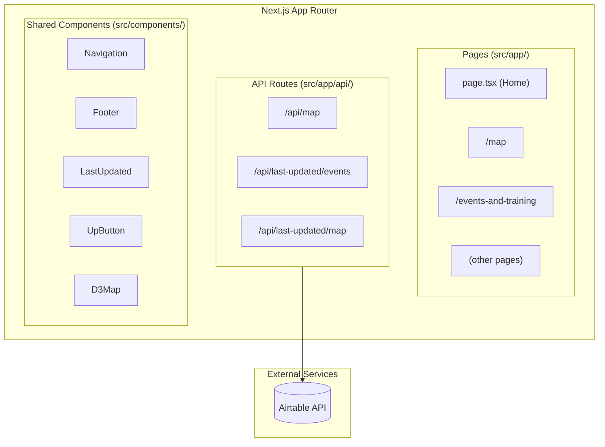

# AISafety.com - Project Overview

## Executive Summary

AISafety.com is a **Next.js 16 web application** serving as the primary resource hub for the AI Safety community. The site was migrated from WebFlow and provides curated lists of events, communities, courses, jobs, funding opportunities, and an interactive ecosystem map of organizations working on AI existential safety.

## Project Information

| Attribute             | Value                   |
| --------------------- | ----------------------- |
| **Project Name**      | AISafety.com            |
| **Repository Type**   | Monolith                |
| **Primary Language**  | TypeScript              |
| **Framework**         | Next.js 16 (App Router) |
| **Deployment Target** | Vercel                  |
| **License**           | CC BY-SA                |

## Purpose and Goals

The website aims to help people **find their place in the AI safety ecosystem** by providing:

1. **Events & Training** - Upcoming events, workshops, and training programs
2. **Field Map** - Interactive D3.js visualization of 300+ organizations
3. **Communities** - Online and in-person AI safety communities
4. **Self-Study** - Courses and learning resources
5. **Jobs** - Open positions in AI safety organizations
6. **Funding** - Grant opportunities and funders
7. **Advisors** - 1-on-1 career advising resources
8. **Projects** - Volunteer opportunities

## Technology Stack Summary

| Category    | Technology   | Version |
| ----------- | ------------ | ------- |
| Framework   | Next.js      | 16.0.7  |
| UI Library  | React        | 19.2.0  |
| Language    | TypeScript   | ^5      |
| Styling     | Tailwind CSS | ^4      |
| Data Viz    | D3.js        | ^7.9.0  |
| Data Source | Airtable     | ^0.12.2 |
| Linting     | ESLint       | ^9      |
| Formatting  | Prettier     | ^3.7.4  |

## Architecture Overview



## Key Features

### 1. Interactive Ecosystem Map

- Built with D3.js for pan/zoom functionality
- Displays 300+ AI safety organizations
- Category filtering and search
- Responsive design with mobile support

### 2. Dynamic Data from Airtable

- All content sourced from Airtable databases
- API routes proxy requests with caching (5-minute revalidation)
- Real-time "last updated" timestamps

### 3. WebFlow Migration

- Custom CSS preserves original WebFlow design
- Inter font family for typography consistency
- Responsive grid layouts

## Quick Links

- [Architecture Documentation](./architecture.md)
- [Source Tree Analysis](./source-tree-analysis.md)
- [API Contracts](./api-contracts.md)
- [Component Inventory](./component-inventory.md)
- [Development Guide](./development-guide.md)

## Getting Started

```bash
# Install dependencies
npm install

# Set up environment variables
cp .env.example .env.local
# Add your Airtable credentials

# Start development server
npm run dev

# Open http://localhost:3000
```

## Environment Variables Required

| Variable           | Description                    |
| ------------------ | ------------------------------ |
| `AIRTABLE_TOKEN`   | Airtable Personal Access Token |
| `AIRTABLE_BASE_ID` | Airtable Base ID               |
